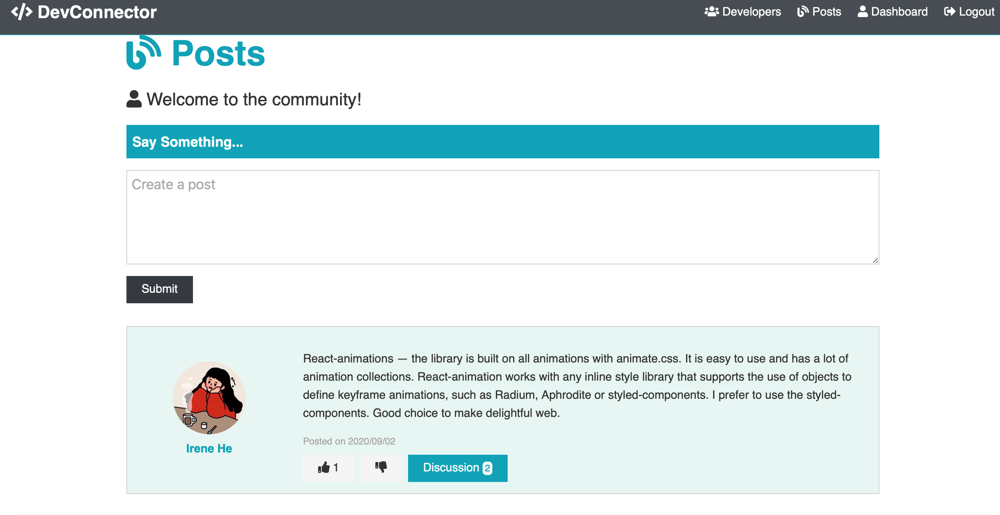
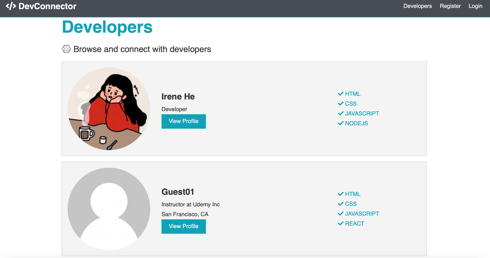

# DevConnector
This is an in-depth full-stack social network application for developers from [the Udemy Course - MERN Stack Front To Back by Brad Traversy](https://www.udemy.com/course/mern-stack-front-to-back/)
# Live Demo
To see the app in action, go to:[DevConnector Demo](https://dev-connector-web.herokuapp.com/)
- Login email : guest01@email.com
- Login password : guest123
## Demo Images

# Features
- Authentication:
  - User login with email and password
- Authorization:
  - One cannot manage posts and user profile without being authenticated
  - One cannot remove posts, comments, and change like/unlike action created by other users
- Manage user portfolio with basic functionalities:
  - Create, edit the basic infomation about user as developer, such as skills, github repos and soicial links
  - Add, modify and delete experiences and educations
- Flash alerts responding to users’ interaction with the app
- Responsive web design
# Custom Enhancements
- Like/Unlike posts
- Implemented React-animations to create aesthetic web pages
- Used Google Fonts instead default fonts and Font Awesome for icons
- Used momentJS to show post and comment creation and update timestamp
- Integrated Gravatar API where users can get default avatar according their email
- Added funtionality to display user's github repos based on provided github username
# Built with
- Front-end
  - [React](https://github.com/facebook/react)
  - [Redux](https://github.com/reduxjs/redux)
  - [Font Awesome](https://fontawesome.com/)
  - [React-Animations](https://www.npmjs.com/package/react-animations)
  - [moment](https://momentjs.com/)
  - [React-Router-Dom](https://github.com/ReactTraining/react-router/tree/master/packages/react-router-dom)
  - [axios](https://github.com/axios/axios)
  - [validator](https://github.com/validatorjs/validator.js)
- Back-end
  - [Express](https://expressjs.com/)
  - [MongoDB](https://www.mongodb.com/)
  - [JWT](https://github.com/auth0/node-jsonwebtoken)
  - [Mongoose](https://mongoosejs.com/)
  - [passport](http://www.passportjs.org/)
  - [dotenv](https://www.npmjs.com/package/dotenv)
  - [bcryptjs](https://www.npmjs.com/package/bcryptjs)
  - [gravatar](https://en.gravatar.com/)
  - [normalize-url](https://www.npmjs.com/package/normalize-url)

# Deployment
- [Heroku](https://heroku.com/)
